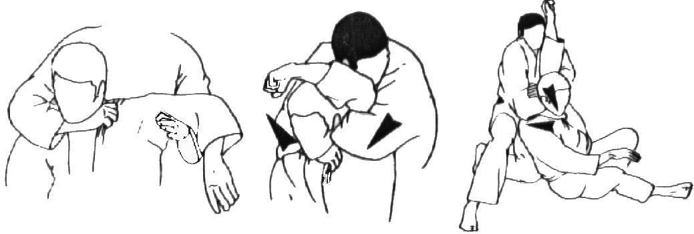

# Kata Code Jam

These are a compilation of several code exercises that I have found interesting. These are simple algorithmic problems, the goal is not the design of a complex software but just the technique to solve classical computer science problems.

## Exercises

- [_Bubble Sort Algorithm_][1] - Implementation of the Bubble Sort Algorithm.
- [_Star Wars Movies Order_][2] - Ordering the Star Wars movies from the release date to chronologically.
- [_Javascript TDD Seed_][3] - Little seed that facilitates a minimum framework to do TDD on Javascript.- [_Javascript TDD Seed_][3] - Little seed that facilitates a minimum framework to do TDD on Javascript.
- [_String Composer_][4] - String manipulation casuistic with Javascript

[1]: https://github.com/joantolos/kata-code-jam/tree/master/bubble-sort
[2]: https://github.com/joantolos/kata-code-jam/tree/master/star-wars
[3]: https://github.com/joantolos/kata-code-jam/tree/master/javascript-tdd-seed
[4]: https://github.com/joantolos/kata-code-jam/tree/master/string-composer