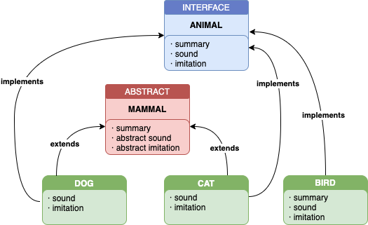

# Override polymorphism and Factory builder pattern

Example of factory builder pattern and overriding polymorphism made on Typescript.

The animal factory will build an instance of "Dog", "Cat" or "Bird" depending on the animal id provided. All three classes implement the interface Animal which has three methods: sound, imitation and summary.

Dog and Cat extend the abstract class Mammal, but Bird does not. For the cases of Dog and Cat, the implementation of "summary" is on the abstract class "Mammal", so they only have to implement "sound" and "imitation". Bird is not a mammal thought, so it has to implement the three methods: summary, sound and imitation.

This example serves to illustrate the case for Override Polymorphism as the class Mammal has two abstract methods (sound and imitation) that needs to implement the method summary. These abstract methods are override on Cat and Dog classes.
