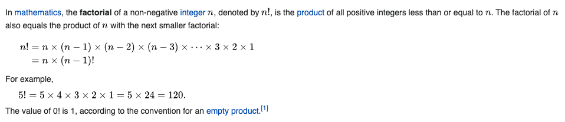

# Tail recursion

An example of how tail recursion is more optimal than regular recursion for functional languages, using the factorial problem as example.

## What is factorial

https://en.wikipedia.org/wiki/Factorial