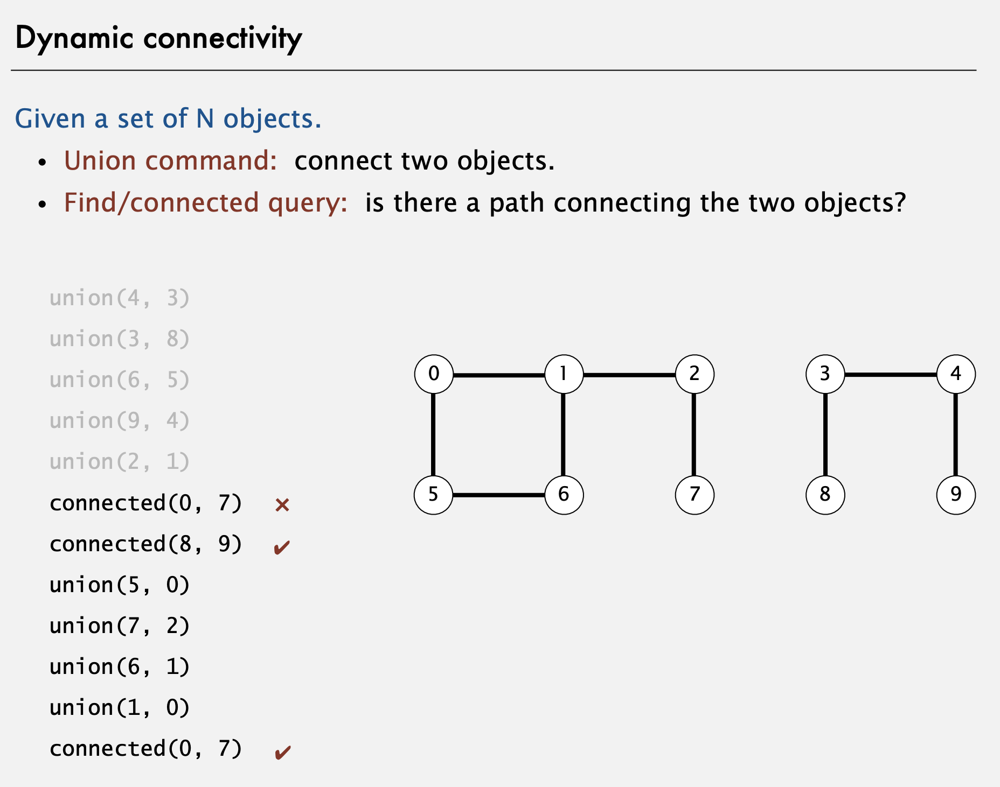

# Union find

Union find is a possible solution for the dynamic connectivity problem: Given a set of N objects; **union** connects two objects; **find** says if is there a path connecting the two objects.

Respect the following equivalence relations:
- Reflexive: p is connected to p
- Symmetric: if p is connected to q, then q is connected to p
- Transitive: if p is connected to q and q is connected to r, then p is connected to r

Implement a data structure that, given p and q, connects them and given p and q return true if are connected and false otherwise.